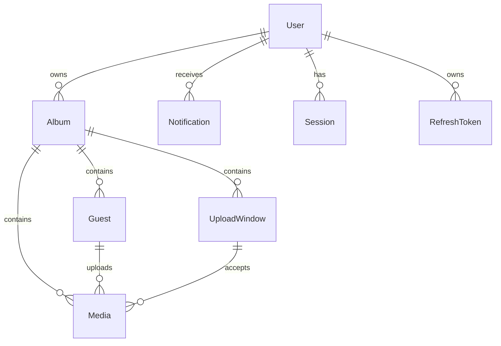

# Database

**Database:** PostgreSQL

**ORM:** Prisma

---

# Database Overview

Livara uses PostgreSQL as its primary relational database.

The database is designed around a normalized relational model to ensure:

- Data integrity
- High performance
- Scalability
- Maintainability

The database stores application metadata only.

Large binary objects such as images and videos are stored separately in Cloudflare R2.

The database references these files using storage paths and metadata.

---

# Design Principles

The database follows these principles.

## UUID Primary Keys

Every entity uses UUID as its primary identifier.

---

## Normalization

Data should avoid unnecessary duplication.

---

## Referential Integrity

Foreign key constraints maintain valid relationships.

---

## Auditability

Important entities include:

- createdAt
- updatedAt
- deletedAt (where applicable)

---

## Scalability

Tables should support millions of records without structural changes.

---

## Consistency

Business rules should be enforced through database constraints whenever possible.

---

# Naming Conventions

## Tables

Tables use singular PascalCase.

Examples:

User

Album

Media

Guest

UploadWindow

---

## Columns

Columns use camelCase.

Examples:

createdAt

updatedAt

albumId

uploadWindowId

---

## Foreign Keys

Foreign keys use:

<Entity>Name + Id

Examples:

albumId

guestId

organizerId

---

## Enums

Enums use PascalCase.

Example:

AlbumStatus

MediaStatus

UserRole

---

# Database Conventions

## Timestamps

Every major table includes:

- createdAt
- updatedAt

---

## Soft Delete

Tables supporting soft deletion include:

- User
- Album
- Media

Soft deletion uses:

deletedAt

---

## IDs

Every table uses UUID.

---

## Timezone

All timestamps are stored in UTC.

---

## Boolean Defaults

Boolean fields default to false unless otherwise specified.

---

## Status Fields

Entity states are represented using enums instead of free-text values.

---

# Entity Relationship Overview

The database consists of the following core entities.

User

↓

Album

↓

UploadWindow

↓

Media

↓

Storage

Guests interact with Albums and upload Media.

Notifications belong to Users.

Sessions belong to Users.

Refresh Tokens belong to Users.

Each Album may contain multiple Upload Windows and multiple Media records.

---

# User

## Purpose

Represents authenticated platform users.

A User can have one of the following roles:

- Super Admin
- Organizer

Guests are stored separately and do not have user accounts.

---

## Columns

| Column | Type | Required | Description |
|---------|------|----------|-------------|
| id | UUID | Yes | Primary key |
| email | String | Yes | Unique email address |
| passwordHash | String | Yes | Hashed password |
| firstName | String | Yes | First name |
| lastName | String | Yes | Last name |
| role | UserRole | Yes | User role |
| avatarUrl | String | No | Profile image |
| isActive | Boolean | Yes | Account status |
| lastLoginAt | Timestamp | No | Last login |
| createdAt | Timestamp | Yes | Creation time |
| updatedAt | Timestamp | Yes | Last update |
| deletedAt | Timestamp | No | Soft delete |

---

## Indexes

Primary Key:

- id

Unique:

- email

Indexes:

- role
- isActive

---

## Constraints

- Email must be unique.
- Password must be hashed.
- Role must use UserRole enum.

---

## Relationships

One User

↓

Many Albums

↓

Many Notifications

↓

Many Sessions

↓

Many Refresh Tokens

---

# Album

## Purpose

Represents an event album.

Albums are the central entity of the platform.

---

## Columns

| Column | Type | Required | Description |
|---------|------|----------|-------------|
| id | UUID | Yes | Primary key |
| organizerId | UUID | Yes | Owner of the album |
| title | String | Yes | Album title |
| description | Text | No | Album description |
| coverMediaId | UUID | No | Cover image |
| qrCode | String | Yes | QR identifier |
| publicSlug | String | Yes | Public URL slug |
| eventDate | Timestamp | No | Event date |
| location | String | No | Event location |
| status | AlbumStatus | Yes | Current status |
| uploadsEnabled | Boolean | Yes | Upload toggle |
| downloadsEnabled | Boolean | Yes | Download toggle |
| createdAt | Timestamp | Yes | Creation time |
| updatedAt | Timestamp | Yes | Last update |
| deletedAt | Timestamp | No | Soft delete |

---

## Indexes

Primary Key:

- id

Unique:

- qrCode
- publicSlug

Indexes:

- organizerId
- status
- eventDate

---

## Relationships

One Album

↓

Many Upload Windows

↓

Many Guests

↓

Many Media

↓

Many Notifications

---

# UploadWindow

## Purpose

Defines a scheduled time period during which guests are allowed to upload media.

---

## Columns

| Column | Type | Required | Description |
|---------|------|----------|-------------|
| id | UUID | Yes | Primary key |
| albumId | UUID | Yes | Parent album |
| title | String | Yes | Window name |
| startsAt | Timestamp | Yes | Opening time |
| endsAt | Timestamp | Yes | Closing time |
| status | UploadWindowStatus | Yes | Current state |
| createdAt | Timestamp | Yes | Creation time |
| updatedAt | Timestamp | Yes | Last update |

---

## Indexes

- albumId
- startsAt
- endsAt
- status

---

## Constraints

- endsAt must be greater than startsAt.
- Upload windows within the same album must not overlap.

---

## Relationships

One Upload Window

↓

Many Media

---

# Guest

## Purpose

Represents an anonymous visitor who accesses an album through a QR code or public link.

Guests do not have authenticated accounts but may optionally provide a display name.

---

## Columns

| Column | Type | Required | Description |
|---------|------|----------|-------------|
| id | UUID | Yes | Primary key |
| albumId | UUID | Yes | Associated album |
| displayName | String | No | Guest name |
| sessionToken | String | Yes | Anonymous session identifier |
| lastSeenAt | Timestamp | No | Last activity |
| createdAt | Timestamp | Yes | First visit |
| updatedAt | Timestamp | Yes | Last update |

---

## Indexes

Primary Key:

- id

Indexes:

- albumId
- sessionToken

---

## Constraints

- Session token must be unique.
- Every Guest belongs to exactly one Album.

---

## Relationships

One Guest

↓

Many Media

---

# Media

## Purpose

Represents an uploaded image or video stored in the platform.

Media metadata is stored in PostgreSQL.

Binary files are stored in Cloudflare R2.

---

## Columns

| Column | Type | Required | Description |
|---------|------|----------|-------------|
| id | UUID | Yes | Primary key |
| albumId | UUID | Yes | Parent album |
| uploadWindowId | UUID | No | Upload window |
| guestId | UUID | No | Guest uploader |
| type | MediaType | Yes | Image or Video |
| status | MediaStatus | Yes | Processing state |
| originalPath | String | Yes | Original file path |
| previewPath | String | No | Optimized preview |
| thumbnailPath | String | No | Thumbnail |
| mimeType | String | Yes | MIME type |
| fileName | String | Yes | Original filename |
| fileSize | BigInt | Yes | File size (bytes) |
| width | Integer | No | Media width |
| height | Integer | No | Media height |
| duration | Integer | No | Video duration (seconds) |
| uploadedAt | Timestamp | Yes | Upload time |
| createdAt | Timestamp | Yes | Record creation |
| updatedAt | Timestamp | Yes | Record update |
| deletedAt | Timestamp | No | Soft delete |

---

## Indexes

Primary Key:

- id

Indexes:

- albumId
- guestId
- uploadWindowId
- status
- uploadedAt

---

## Constraints

- Original path is required.
- File size must be greater than zero.
- Status must use MediaStatus enum.

---

## Relationships

One Media belongs to:

- Album
- Guest (optional)
- Upload Window (optional)

---

# Notification

## Purpose

Represents system notifications delivered to authenticated users.

---

## Columns

| Column | Type | Required | Description |
|---------|------|----------|-------------|
| id | UUID | Yes | Primary key |
| userId | UUID | Yes | Recipient |
| type | NotificationType | Yes | Notification category |
| title | String | Yes | Notification title |
| message | Text | Yes | Notification content |
| isRead | Boolean | Yes | Read status |
| createdAt | Timestamp | Yes | Creation time |

---

## Indexes

- userId
- isRead
- createdAt

---

## Relationships

Many Notifications

↓

One User

---

# Session

## Purpose

Represents an authenticated user session.

---

## Columns

| Column | Type | Required | Description |
|---------|------|----------|-------------|
| id | UUID | Yes | Primary key |
| userId | UUID | Yes | Owner |
| ipAddress | String | No | Login IP |
| userAgent | String | No | Browser information |
| expiresAt | Timestamp | Yes | Session expiration |
| createdAt | Timestamp | Yes | Creation time |

---

## Indexes

- userId
- expiresAt

---

## Relationships

Many Sessions

↓

One User

---

# RefreshToken

## Purpose

Stores active refresh tokens used to renew access tokens.

---

## Columns

| Column | Type | Required | Description |
|---------|------|----------|-------------|
| id | UUID | Yes | Primary key |
| userId | UUID | Yes | Owner |
| tokenHash | String | Yes | Hashed refresh token |
| expiresAt | Timestamp | Yes | Expiration time |
| revokedAt | Timestamp | No | Revocation time |
| createdAt | Timestamp | Yes | Creation time |

---

## Indexes

- userId
- expiresAt

---

## Constraints

- Refresh tokens are stored only as hashes.
- Expired tokens must not be accepted.

---

## Relationships

Many Refresh Tokens

↓

One User

---

# Enums

## UserRole

Defines the role of an authenticated user.

| Value | Description |
|--------|-------------|
| SUPER_ADMIN | Full platform access |
| ORGANIZER | Manages own albums |

---

## AlbumStatus

Represents the current lifecycle state of an album.

| Value | Description |
|--------|-------------|
| DRAFT | Album created but not configured |
| READY | Album configured and ready to share |
| ACTIVE | Album is active |
| ARCHIVED | Album archived |
| DELETED | Soft deleted |

---

## UploadWindowStatus

Represents the state of an upload window.

| Value | Description |
|--------|-------------|
| SCHEDULED | Waiting to open |
| ACTIVE | Uploads allowed |
| CLOSED | Upload period ended |
| CANCELLED | Window cancelled |

---

## MediaType

Defines the uploaded media type.

| Value | Description |
|--------|-------------|
| IMAGE | Image file |
| VIDEO | Video file |

---

## MediaStatus

Represents the processing state of uploaded media.

| Value | Description |
|--------|-------------|
| UPLOADING | Upload in progress |
| PROCESSING | Background processing |
| READY | Available in gallery |
| FAILED | Processing failed |
| DELETED | Soft deleted |

---

## NotificationType

Defines notification categories.

| Value | Description |
|--------|-------------|
| MEDIA_UPLOADED | New media uploaded |
| UPLOAD_WINDOW_OPENED | Upload window opened |
| UPLOAD_WINDOW_CLOSED | Upload window closed |
| ZIP_READY | Album archive ready |
| SYSTEM | General system notification |

---

# Relationships

## User

One User can own many Albums.

One User can receive many Notifications.

One User can have many Sessions.

One User can have many Refresh Tokens.

---

## Album

One Album belongs to one User.

One Album has many Upload Windows.

One Album has many Guests.

One Album has many Media.

---

## UploadWindow

One Upload Window belongs to one Album.

One Upload Window contains many Media.

---

## Guest

One Guest belongs to one Album.

One Guest may upload many Media.

---

## Media

One Media belongs to one Album.

One Media may belong to one Guest.

One Media may belong to one Upload Window.

---

## Notification

One Notification belongs to one User.

---

## Session

One Session belongs to one User.

---

## RefreshToken

One RefreshToken belongs to one User.

---

# Indexing Strategy

Indexes are created to optimize common queries.

## Primary Keys

Every table uses UUID primary keys.

---

## Unique Indexes

- User.email
- Album.publicSlug
- Album.qrCode
- Guest.sessionToken

---

## Foreign Key Indexes

- Album.organizerId
- UploadWindow.albumId
- Guest.albumId
- Media.albumId
- Media.guestId
- Media.uploadWindowId
- Notification.userId
- Session.userId
- RefreshToken.userId

---

## Performance Indexes

- Album.status
- UploadWindow.status
- UploadWindow.startsAt
- UploadWindow.endsAt
- Media.status
- Media.uploadedAt
- Notification.isRead

---

# Constraints

The database enforces business rules through constraints.

## Examples

- User email must be unique.
- Album QR codes must be unique.
- Album public slugs must be unique.
- Upload window end time must be after start time.
- File size must be greater than zero.
- Foreign keys must reference existing records.
- Required fields cannot be null.

---

# Soft Delete Strategy

Soft deletion is used to preserve historical data and allow recovery.

## Tables using Soft Delete

- User
- Album
- Media

Soft delete is implemented using:

deletedAt TIMESTAMP NULL

Records with a non-null deletedAt value are excluded from normal application queries.

---

# Migration Strategy

Database schema changes are managed using Prisma Migrations.

Migration rules:

- Every schema change requires a migration.
- Migrations are version controlled.
- Migrations must be reversible when possible.
- Production migrations are executed automatically through the deployment pipeline.

---

# Backup & Recovery

Regular backups are required to protect application data.

## Database

- Daily automated backups
- Point-in-time recovery (future)

## Object Storage

Cloudflare R2 redundancy provides object durability.

Critical archives may be copied to secondary storage in future versions.

---

# Seed Data

The initial database seed includes:

- Default Super Admin
- User roles
- Default system settings
- Notification templates

Seed data is managed using Prisma Seed.

---

# ER Diagram

---

